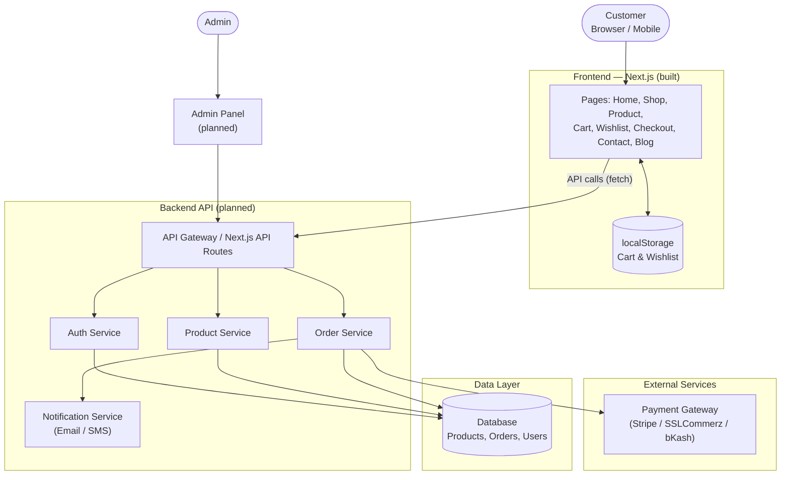

# E-Commerce Website — Frontend + Backend (Architecture & Setup)

Ei document e website-er **frontend** (already built) ar **backend** (planned/next step) — dutor structure, setup, ar architecture diagram deya ache.


<p align="center">
  <a href="YOUR_FRONTEND_LIVE_LINK" target="_blank">
    
  </a>

  <a href="YOUR_BACKEND_LIVE_LINK" target="_blank">
    
  </a>
</p>

---

## System Architecture Diagram




**Legend:**
- **Frontend box:** already built and working
- **Backend / External / Data boxes:** planned — next development phase

---


---

## 1. Project Overview

- **Business model:** Own manufactured products, direct to customer (D2C)
- **Frontend:** Next.js (App Router) + React, plain JSX, colors globally controlled from one file
- **Backend:** Not built yet — this README defines the planned structure so frontend ar backend eksathe kaj korte pare
- **Status:** Frontend done ✅ | Backend planned 🔜

---

## 2. Frontend

### Tech stack
- Next.js (App Router), React, JSX (no TypeScript)
- Plain CSS with CSS variables (no UI framework)
- Cart/Wishlist ekhon browser `localStorage` e save hoy (backend na thakle o kaj kore)

### Run it
```bash
cd ecommerce-site
npm install
npm run dev        # http://localhost:3000
npm run build && npm start
```

### Where to change things

| What | File |
| --- | --- |
| **Colors (whole site)** | `app/globals.css` → `:root { ... }` block |
| Brand name, phone, email, address, currency, tax | `lib/config.js` |
| Products, categories, blog posts | `lib/data.js` |
| Product photos | `public/products/` + `image: "/products/name.jpg"` |
| Fonts | `app/layout.jsx` |

### Pages
`/` home · `/products` shop (filters) · `/products/[id]` details · `/cart` · `/wishlist` · `/checkout` · `/contact` · `/blog` · `/blog/[slug]`

---

## 3. Backend (planned)

Backend ekhono build kora hoyni. Eta build korar shomoy ei services gulo lagbe:

| Service | Kaj | Suggested tech |
| --- | --- | --- |
| **Auth Service** | Customer signup/login, admin login | Node.js/Express ba Next.js API routes + JWT |
| **Product Service** | Product, category, stock manage | Same backend + Database |
| **Order Service** | Cart → order convert, order status track | Same backend |
| **Payment Gateway** | Online payment (card/mobile banking) | Stripe / SSLCommerz / bKash / Nagad |
| **Notification Service** | Order confirmation email/SMS | SendGrid / Twilio / local SMS gateway |
| **Admin Panel** | Product, order, customer manage | Separate dashboard (Next.js ba alada app) |
| **Database** | Product, order, user, review data store | MongoDB |

### Suggested API routes (jokhon backend banano hobe)
```
POST   /api/auth/register
POST   /api/auth/login
GET    /api/products
GET    /api/products/:id
POST   /api/orders
GET    /api/orders/:id
POST   /api/payments/create-intent
POST   /api/payments/webhook
```


## 4. Before Going Live (Checklist)

- [ ] Payment gateway connect kora (raw card number nijer server e store na kore, gateway-er hosted field use korte hobe)
- [ ] Order database e save howa (ekhon demo — shudhu screen e dekhay, save hoy na)
- [ ] Contact form backend/email service e connect kora
- [ ] Admin panel banano (product/order manage korar jonno)
- [ ] Real product photo ar description diye sample data replace kora
- [ ] Domain, hosting, SSL setup
